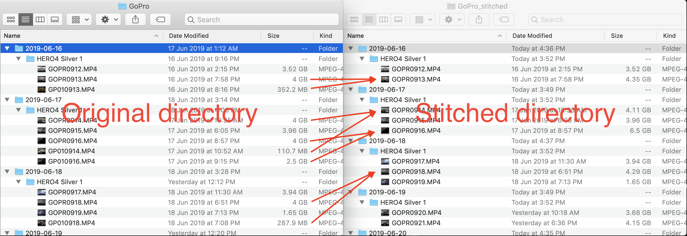

# GoPro Stitcher


Automatic stitcher for your fragmented GoPro videos.



## Usage

MacOS:
Install required third-party packages:
```
brew install ffmpeg
brew install exiftool
```

Install project dependencies:
```
pipenv install
```

If [`pipenv`](https://docs.pipenv.org/en/latest/) does not exist, make sure you have `invoke` in your Python path, maybe:
```
pip install invoke==1.2.0
```

Then run the script:
```
pipenv run invoke stitch-gopro-videos ~/Pictures/GoPro --include-single-files
```

Or get help:
```
pipenv run invoke -h stitch-gopro-videos
```

Without `pipenv`, equivalent commands would be:
```
invoke stitch-gopro-videos ~/Pictures/GoPro --include-single-files
invoke -h stitch-gopro-videos
```

## Notes

Geo-location data stitching (GPS info) is not supported, since the work is for my dated GoPro 4.

I will be happy to explore the feasibility if you could kindly help provide sample videos!
